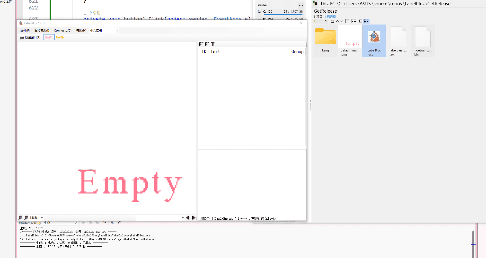

# LabelPlus+

基于[LabelPlus](https://github.com/LabelPlus/LabelPlus)修改的标号器。修改了一些功能

## 较原版改动

+ 重写了PicView控件以优化缩放和标签绘制
+ 修改了交互逻辑，与[Moeflow前端](https://github.com/moeflow-com/moeflow-frontend)保持一致
+ 删除了不同的浏览模式
+ 只保留了框内框外两个标签组
+ 增加在线项目下载以及本地项目上传，理论上支持所有[Moeflow后端](https://github.com/moeflow-com/moeflow-backend)

## 功能展示

下载：

上传：

若您想要调整标签颜色，请打开`labelplus_config.xml`，修改`GroupDefine`中`Group`为`框内`和`框外`的两项内的`RGB`节点即可

**注意：登录信息会保存在程序目录下的`moetran_token.bin`中，若您打算分享LabelPlus，请将该文件排除！**

其他信息请参考原仓库的[说明](https://github.com/LabelPlus/LabelPlus/blob/master/README.md)

